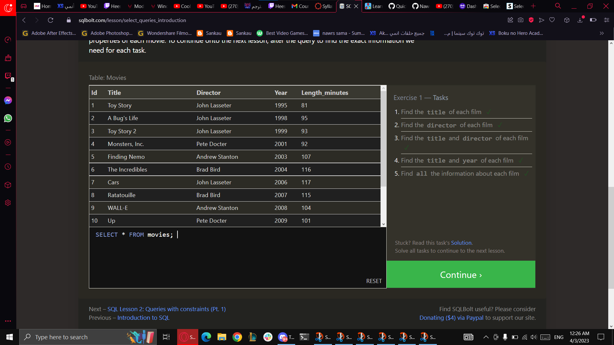
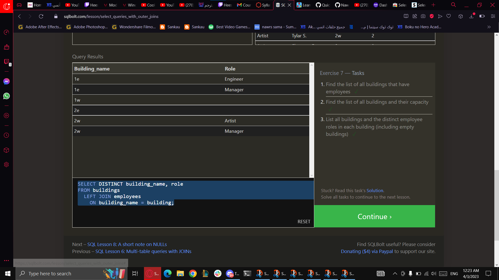
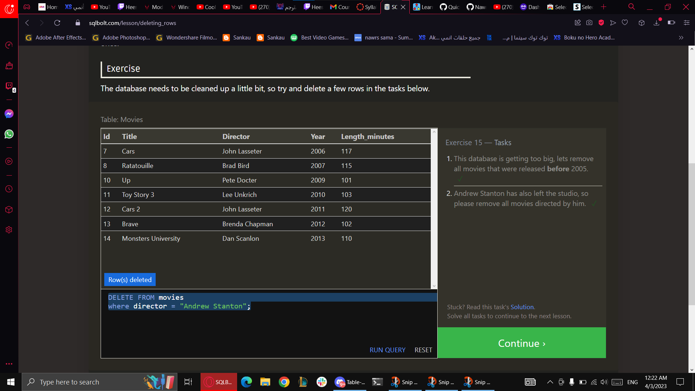

sql

Relational databases organize data into tables with columns and rows. SQL is a programming language used to manage and manipulate relational databases. It provides a standardized way to interact with databases and supports a wide range of operations. Together, they offer a powerful and flexible way to store and manipulate data for various applications and industries.

 
 
 
 
 
 
 
 
 
 
 
 
 
 
 

